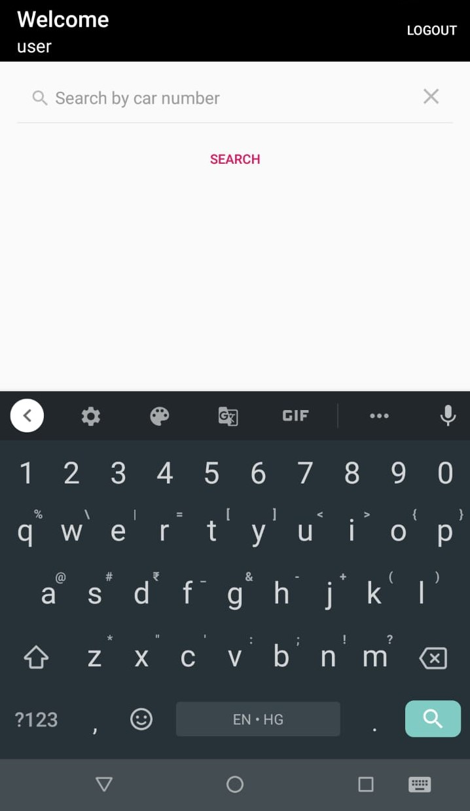
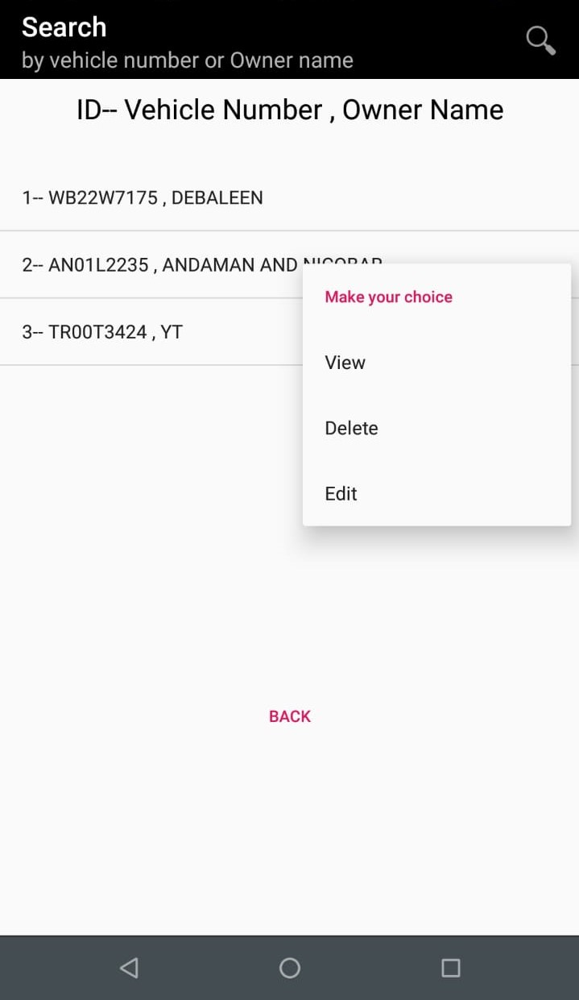
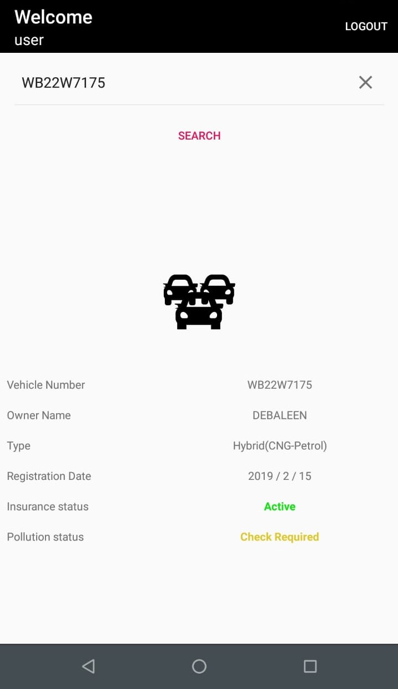
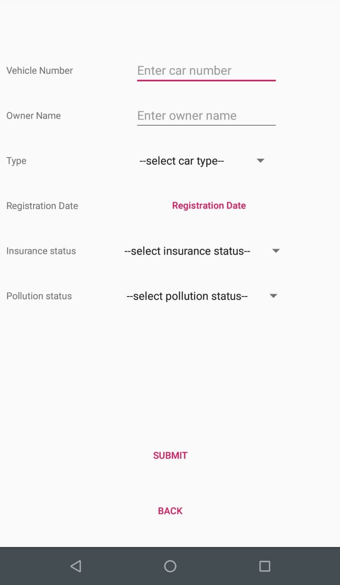

<p align="center">
  
</p>

# RtoOfficeApp-Android

[](LICENSE)


**Rto Office App** is a sample Android application 📱 built for vehicle owners, traffic police and vehicle registration officers to maintain the reords of Insurace status and Pollution check status of vehicles. Dedicated to all Android Developers with ❤️. 

<table style="width:100%">
  <tr>
    <th>Search Screen (Accessible to general users)</th>
    <th>All Vehicles Screen (Accessible only by admins users)</th>
    <th>Vehicle Details Screen</th>
    <th>Vehicle Registration Screen (Accessible only by admins users)</th>
  </tr>
  <tr>
    <td></td>
    <td></td>
    <td></td>
    <td></td>
  </tr>
</table>

## About
- The app has two UI dashboards. One for general users i.e. vehicle owners and another for admin users i.e. traffic police and vehicle registration officers.
- Admin users can view, modify, add or delete any vehicle details entry.
An admin user can also add another admin user.
- General users can only view specific vehicle details by searching via vehicle registration number.
- The app shows details like registration number, owner name, type of the vehicle, registration date, insurance status and pollution status of the vehicle.

*It uses locally stored SQLite Database.*

## Built With 🛠
- [Java](https://docs.oracle.com/javase/8/docs/technotes/guides/language/index.html) - A general-purpose, concurrent, strongly typed, class-based object-oriented language.
- [SQLite Database for Android](https://developer.android.com/reference/android/database/sqlite/package-summary) - For storing data
- [FancyToast-Android](https://github.com/Shashank02051997/FancyToast-Android) - A library that takes the standard Android toast to the next level with a variety of styling options.
- [DroidCrypt](https://github.com/pahlevikun/DroidCrypt) - A simple Android Library. Very easy for use this Android library for performing encryption to String with AES encryption, it can used for save to SharedPreferences too.


## License
```
MIT License

Copyright (c) 2020 Debaleen Das Spandan

Permission is hereby granted, free of charge, to any person obtaining a copy
of this software and associated documentation files (the "Software"), to deal
in the Software without restriction, including without limitation the rights
to use, copy, modify, merge, publish, distribute, sublicense, and/or sell
copies of the Software, and to permit persons to whom the Software is
furnished to do so, subject to the following conditions:

The above copyright notice and this permission notice shall be included in all
copies or substantial portions of the Software.

THE SOFTWARE IS PROVIDED "AS IS", WITHOUT WARRANTY OF ANY KIND, EXPRESS OR
IMPLIED, INCLUDING BUT NOT LIMITED TO THE WARRANTIES OF MERCHANTABILITY,
FITNESS FOR A PARTICULAR PURPOSE AND NONINFRINGEMENT. IN NO EVENT SHALL THE
AUTHORS OR COPYRIGHT HOLDERS BE LIABLE FOR ANY CLAIM, DAMAGES OR OTHER
LIABILITY, WHETHER IN AN ACTION OF CONTRACT, TORT OR OTHERWISE, ARISING FROM,
OUT OF OR IN CONNECTION WITH THE SOFTWARE OR THE USE OR OTHER DEALINGS IN THE
SOFTWARE.
```